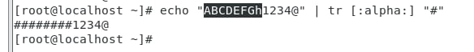
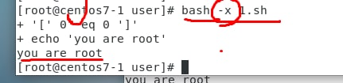
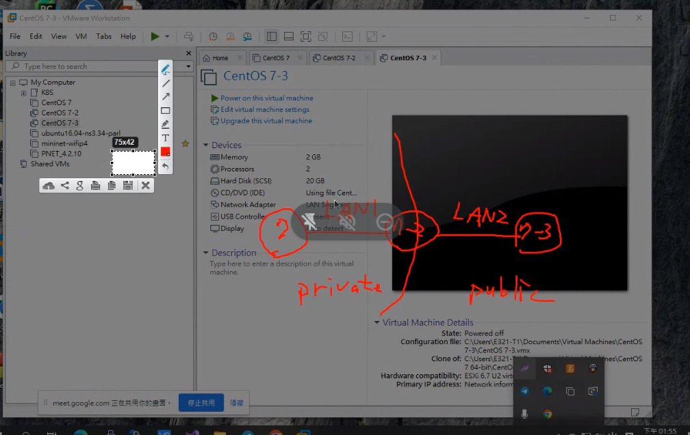
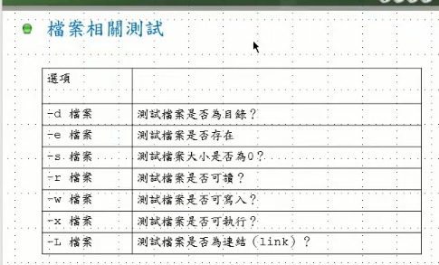
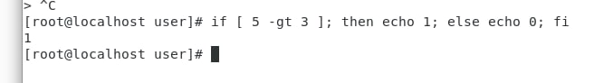
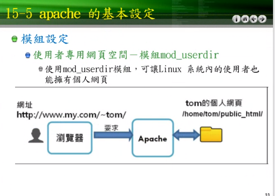
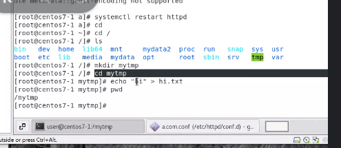

[vi 的使用](https://dywang.csie.cyut.edu.tw/dywang/linuxSystem/node50.html)

# 一9/4

忘了說，期末有給我上課整理筆記的可以加分，另外，有主動報告我上課沒教過的server也可以加分

* Basic

1. linux installation 50
2. network setting(network manager,networking)10,10
3. ssh server(no passwd,scp,sftp)5,5,5
4. ftp server 10
5. samba 10
6. nfs 10
7. www(apache,nginx,open resty)20-30
8. php
9. mysql
10. DNS basic
11. ipv6
12. NAT
13. DHCP


enps03: NAT網路卡(連internet

enps08: host-only network(跟另一台機器連結)

1.

```
ifconfig
ping ip(enp0s8)
click net setting->enps08->wire setting-> ipv4->choose manual->address(enps08)->network(255.255.255.0)兩台都要做->固定IP
su
centos
host
hostnamectl set-hostname centos7-5(另一台改7-3)
(bash)
(ifconfig enp0s8)
gedit /etc/hosts or vim /etc/hosts :wq(exit)
add ip(enps08 centos7-3上) centos7-3 [在兩台改]
add ip(enps08 centos7-5上) centos7-5 [在兩台改]
ping centos7-5 (在centos7-3ping)
```

2.

```
getenforce (check security linux close) ->disable[在兩台檢查]
if enable -> setenforce0
systemctl status firewalld ->Active: inactive(dead)[在兩台檢查]
systemctl status sshd -> Active: active(running)[在兩台檢查]
->if not running-> systemctl start sshd[在兩台檢查]
ssh root@centos7-5(在centos7-3打)
下面的問題有yes/no為有密碼登入(顯示這ctrl+c 跳出，並改成如下)
ssh-keygen(first run)->generate public key,private key
ssh-copy-id root@centos7-5
#產生的位置
cd
cd ~s
cd ~sshd/
pwd
cd ..
pwd
cd
ls
ls -al
cd .ssh
ls
pwd
cat id_rsa (check private key)
cat id_pub (check public key)
ls
###########################################
ssh root@centos7-5(在centos7-3打)
下面的問題有yes/no->yes
自訂密碼(user||centos)
ssh root@centos7-5(在centos7-3打)->變成無密碼登入
cd
ls
touch a.txt
scp a.txt root@centos7-5:/root/
切到centos7-5
cd
ls
pwd(centos7-5上有a.txt)
```


# 二9/12

## NFS

* network file system
* unix-like 作業系統做檔案分享(linux,unix...)

[install nfs](https://qizhanming.com/blog/2018/08/08/how-to-install-nfs-on-centos-7)
[壓縮](http://note.drx.tw/2008/04/command.html)

rpm -qa查詢本地端是否裝好

-p (不存在:建；存在:不建)->防呆

file b.txt

stat b.txt

find / -atime -1

cat /etc/resolv.conf

cvf 沒有順序性
tar -czvf test.tar.gz text 壓縮
tar -czvf test.tar.gz  解壓
https://blog.gtwang.org/linux/linux-crontab-cron-job-tutorial-and-examples/   ->linux設定工作排程
date +"%Y/%m/%d %H:%M:%S" , main date要查詢的屬性 , date 
tar -cvfz etc-`date +"%Y-%m-%d".tar.gz /etc` -> $()

touch  date +%Y/%m/%d (` +date前%d後= 20221002

timedatectl set-timezone Asia/Taipei
ntpdate clock.stdtime.gov.tw ->(network time prtocol) 
hwlock -w
/1 * * * ->1次/分
1 * * * -> 第一分鐘做一次/時
1 10-12 * * * ==> 10:1 11:1 12:1
gtwang /home/gtwang/script.sh(絕對路徑) --your --parameter

* /etc/crotab
  * 8/29 9:29 => 29 9 15 8 *
  * 每月10日pm5. => 0 17 10 * *
  * 每星期6am4. => 04 * * 6

hw

```
#7-1
su[在兩台做]
sudo yum install nfs-untils[在兩台做]
rmp -qa
rmp -qa | grep rpcbind
rmp -qa | grep nfs
sudo systemctl enable rpcbind[在兩台做]
sudo systemctl enable nfs[在兩台做]
sudo systemctl start rpcbind
sudo systemctl start nfs
getenforce (check security linux close) ->disable
systemctl status firewalld ->Active: inactive(dead)
mkdir /data -p
cd /
ls
chmod 755 data
ll
gedit /etc/exports
/data ip(ens33/255.255.255.0(rw,sync,no_root_squash,no_all_squash)
sudo systemctl restart nfs
showmount -e localhost
###換另一台(7-2)
cd /
ls
mkdir /test -p
mount -t nfs ip(ens33另一台7-1的:/data /test
showmount -e centos7-1
cd test
echo hi > a.txt
ls
#7-1
cd /data
cat a.txt
ls
cat a.txt
ls
echo hello > b.txt
ls
###換另一台(7-2)
ls
#7-1
touch aa
ls

```


# 三9/19

https://josephjsf2.github.io/linux/2019/11/01/share_centos_folder_with_windows.html

testparm

```
cd /boot
cd grub
vim /etc/default/grub 
GRUB_TIMEOUT=10
grub2-mkconfig -o /boot/grub2/grub.cfg
reboot
click "e"
quiet-> quiet 1
///single mod
vim /etc/fstab
/dev/mapper/centos-root /          xfs    default(,usrquota,grpquota)///add        0 0////需要切割出home...
:wq
mount -o remount / 
mount -a
(cat /etc/mtab)
reboot
```


swap 定為記憶體的2倍

获取当前selinux状态getenforce

臨時關閉：setenforce 0

永久關閉:selinux：gedit /etc/sysconfig/selinux 

SELINUX=enforcing 替换为SELINUX=disabled

重启后，运行命令sestatus

SELinux status ： disabled

systemctl status firewalld

臨時關閉：systemctl disable firewalld

永久關閉:先打上，systemctl stop firewalld

hw

```
su
yum install samba samba-client samba-common -y
(mkdir test_samba)
(mkdir -p /test_samba)
(chown noboby /test_samba/)
(ll /test_samba/ -d)->nobody
vim /etc/samba/smb.conf
[global]
        security = user
[test]
		comment = for test
		path = /test_samba(share folder)
		read only = no(read and write)
		(public = yes)
		(writeable = yes)
		guest  ok = yes(user can use)
		(write list = user, tom)
		browerable = yes(no)////can brower
:wq!
testparm
systemctl start smb
(netstat -tunlp) 
(netstat -tunlp |grep smb)
systemctl status smb
smbpasswd -a user
user
cd /test_samba/
ls
echo "hi" > hi.txt
(cat /etc/samba/smb.conf)
(ll -d /test_samba/)
chmod 777 text_samba
ls
cat a.txt
(cd)
(useradd tom)
(passwd tom)
(12345678)
(smbpasswd -a tom)
(groupadd super)
(gpasswd -a user super)
(gpasswd -a tom super)
(id user)
(vim /etc/samba/smb.conf)
[test]
		(write list = @super)
chmod 775 /text_samba/
(chown -R root:super /text_samba/)
(ll -d /test_samba/)
(testparm)
(systemctl restart smb)
(yum install gcc)
(su - tom)
(gcc -o test test.c)
(ls)
(./test)
win+r
input linux ip address(\\ip)
user
user
```


# 9/26


總量50G，用了多少32.5M，用?%


redhat/fedora/centos : rpm/yum   debian/ubuntu: dpkg/apt

wget https://rpmfind.net/linux/epel/7/x86_64/Packages/j/joe-4.6-4.el7.x86_64.rpm 專門下載

h1

+號,手動設定新增分割區;

+home

https://www.it145.com/8/34800.html

```
reboot  # 重新啟動  # 按下e


# 找到quite加上 1 ，按下f10，進入單人模式，要輸入root密碼
vi /etc/fstab
# usrquota,grpquota   加入到default後面，根據user和group進行分類
# mount -o remount /  # 掛載到根目錄
# mount -a
reboot

# 再次進入單人模式
cat /etc/mtab | grep usrquota  # 檢查quota是否出現，沒有出現(/dev/sda  noquota)，就代表失敗了

xfs_quota -xc 'report -h' /home 

xfs_quota -xc "free -h" /home  # 告訴使用者資料使用量
xfs_quota -xc "quota -h user" /home # 查詢單個使用者資料使用量
xfs_quota -xc "limit bsoft=10m bhard=12m user" /home  # 針對user，設定soft上限跟hard上限
su - user # 切換到user
dd if=/dev/zero of=test bs=1M count=13  # dev/zero是零裝置，會給出很多的0，使用dd指令，讀取資料放到test，讀取1MB，讀取13次，所以會有13MB
ll -h # 查看硬體使用量
```


```
redhat/fedora/centos : rpm/yum   debian/ubuntu: dpkg/apt
ll -h
su - user
```


```
dd if=/dev/zero of=test bs=1M count=13
```

RPM <- Redhat

RPM ->(use)-> SuSE、Mandriva、TurboLinux....


```
-qa (rpm -qa | grep httpd)////查詢系統已安裝套件清單
echo $? /////確認指令是否有誤 顯示0///有安裝 顯示非0值///需安裝
-qi (rpm -qi httpd)////查詢特定套件安裝資訊
-ql (rpm -ql httpd | grep bin)////查詢套件所安裝的檔案清單(條列)
-qf (rpm -qf /etc/httpd/conf/httpd.conf)////查詢系統特定檔案的來源安裝套件
```

https://rpmfind.net/linux/rpm2html/search.php?query=joe ->ctrl+f->el7

```
wget https://rpmfind.net/linux/epel/7/x86_64/Packages/j/joe-4.6-4.el7.x86_64.rpm
rpm -ivh joe-4.6-4.el7.x86_64.rpm
```


```
---nodeps ///忽略前置相依性檢查，直接安裝
--force  ///已安裝一個套件，會跳出錯誤，它會忽略此訊息並強制覆蓋重新安裝套件
rpm -Uvh 套件檔案名稱 ////先取得新版檔案，再用它(rpm更新選項-U)操作
rpm -e 套件檔案名稱 ///移除套件
```


```
yum install (yum install tcsh)///安裝某套件
yum update ///升級某套件
yum search(yum search httpd) ////搜尋yum server上含有特定文字，並列出
yum list(yum list docker-ce) ////列出套件名稱、版本、本機是否安裝
```


hw2

```
wget https://src.fedoraproject.org/lookaside/extras/htop/htop-2.2.0.tar.gz/sha512/ec1335bf0e3e0387e5e50acbc508d0effad19c4bc1ac312419dc97b82901f4819600d6f87a91668f39d429536d17304d4b14634426a06bec2ecd09df24adc62e/htop-2.2.0.tar.gz  # compile tool

yum groupinstall "Development Tools"  # include compile tool
yum install ncurses-devel  # install libarary
tar xvfz htop-2.2.0.tar.gz # 解壓縮

cd htop-2.2.0  # 進入資料夾
./configure
make  # compile file
make install  # 把執行檔放到執行檔的位置，配置檔放到配置檔的位置。
htop  # 如果成功就可以執行，按下q可以離開
```

wget https://src.fedoraproject.org/lookaside/extras/htop/htop-2.2.0.tar.gz/sha512/ec1335bf0e3e0387e5e50acbc508d0effad19c4bc1ac312419dc97b82901f4819600d6f87a91668f39d429536d17304d4b14634426a06bec2ecd09df24adc62e/htop-2.2.0.tar.gz

yum groupinstall "Development Tools"


yum install ncurses-devel

htop q->leave

# 10/3

https://askie.today/ngrok-localhost-server-settings/

ngrok =>internet server

centos、httpd(www server)、private ip

https://askie.today/ngrok-localhost-server-settings/

https://snapcraft.io/install/ngrok/centos

hw1


https://dashboard.ngrok.com/get-started/setup

```
su
rpm -qa | grep httpd
systemctl start httpd
systemctl status httpd
netstat -tunlp | grep 21
netstat -tunlp | grep 80
sudo yum install epel-release
sudo yum install snapd
sudo systemctl enable --now snapd.socket
sudo ln -s /var/lib/snapd/snap /snap
sudo snap install ngrok
wget https://bin.equinox.io/c/bNyj1mQVY4c/ngrok-v3-stable-linux-amd64.tgz --no-check-certificate
tar xvfz ngrok-v3-stable-linux-amd64.tgz
./ngrok config add-authtoken 2Fc3MXgvOugrYiBgNQRZeb3dZmz_4KAMZjQvVy7ESpCHYyut8
ps -ef |grep ngrok
(curl 127.0.0.1)
netstat -tunlp |grep 80
vim /etc/httpd/conf/httpd.conf
Listen 8080 -> Listen 80(i)
(systemctl restart httpd)
./ngrok http 80
#net add something
(su)
(cd /var/www/html)
(ls)
(echo "hi hello world 123 NQU" > hi.htm)
(./ngrok ssh 22)
```


```
du (du option file)///磁碟使用狀況
man du
ls -ld
ls -ld /root
ls -ald /root
ls -ald .
ls -al .
du -h
ls -h
pwd
ls -lh
.->此目錄
..->上一層
du -s -h
du -sh
du -hs
du -h -s
du -h -s /home
du -h -s /var
du -h --max-depth=1 /var
du -s -h /home
```


hw2

```
df ///列出目前已掛載分割區資訊
df -h
df -h | grep /dev/shm 
df -h | grep /dev/shm | awk'{print$5}' 
df -h | grep /dev/shm | awk'{print$5}' | tr "%" " "
df -h | grep root | awk '{print $5}' | tr "%" " "
df -h | grep "[/]$" | awk '{print $5}' | tr "%" " "
```


free ///查看記憶體指令 

```
free -m
free -m -h

```


```
dd ////複製檔案，指令輸入來源、輸出對象後
(man) wc:///統計用

* -l(wc -l a.txt) :只顯示行數

* -c(wc -c a.txt) :只顯示字元數

* -w(wc -w a.txt) :只顯示英文字節(包含空白、統計用)
```


tr(translate or delete) ///取代和刪除字元

* [:alnum:]-所有大小寫字母和數字集合

- [:alpha:]-所有大小寫字母集合
- [:blank:]-空白
- [:lower:]- 所有小寫字母
- [:upper:]-所有大寫字母

```
echo "ABCDE" | tr [:upper:] [:lower:]
echo "0931-123-456" | tr -d [:alnum:]
echo "0931-123-456" | tr -d "a-zA-B1-2" 
```





```
echo "0931-123-456" | tr -d "-" 
cut
echo "0931-123-456" | tr -d "-" | cut -f 1-4
echo "0931-123-456" | tr -d "-" | cut -c 1-4
```


# 10/17 

[pptpVPN](https://help.aliyun.com/document_detail/41345.html)

VPN = vitual private network

vpn client <-> vpn client -> pptpd


hw1 

```
yum install -y ppp pptpd 
(yum install epel-release -y)
(yum install pptpd)
(kill -9 3748)
gedit /etc/pptpd.conf
///最下面輸入
localip 192.168.0.1
remoteip 192.168.0.100-200
vim /etc/ppp/options.pptpd
ms-dns 223.5.5.5
ms-dns 223.6.6.6
:wq
(vim /etc/ppp/options.pp tpd)
(ms-dns)
(ms-dns 8.8.8.8)
(ms-dns 9.9.9.9)
(:wq)
vim /etc/ppp/chap-secrets
test pptpd 123456 *
(mary pptpd mary1234 *)
:wq
vim /etc/ppp/ip-up
ifconfig ppp0 mtu 1472
:wq
vim /etc/sysctl.conf
net.ipv4.ip_forward = 1
:wq
sysctl -p
systemctl status firewalld
getenforce
systemctl start pptpd
systemctl status pptpd
(systemctl restart pptpd)
ifconfig
#open VPN
#enter information
#connect VPN
#open cmd
(ipconfig)
ping 192.168.0.1
```


加分題-1

[架設L2TP VPN(CentOS 7.5)](https://blog.aiso.idv.tw/%E3%80%90-linux-%E3%80%91%E6%9E%B6%E8%A8%ADl2tp-vpncentos-7-5/)

```
su
sudo yum install epel-release
kill -9 4163///要讓背景更新軟體刪除，process id是4163
kill -9 4205///刪除背景更新程式，process id=4205
wget https://dl.fedoraproject.org/pub/epel/epel-release-latest-7.noarch.rpm sudo rpm -Uvh epel-release-latest-7*.rpm
yum install strongswan xl2tpd
vim /etc/sysctl.conf
net.ipv4.ip_forward = 1
:wq
sysctl -p
vim /etc/strongswan/ipsec.secrets
:PSK"123456"
:wq
vim /etc/xl2tpd/xl2tpd.conf
[global]
listen-addr = VPN主機IP

[lns default]
ip range = VPN分配起始IP-VPN分配結束IP
local ip = VPN使用出口閘道
require chap = yes
refuse pap = yes
require authentication = yes
name = l2tpd
ppp debug = yes
pppoptfile = /etc/ppp/options.xl2tpd
length bit = yes
:wq
vim /etc/sysctl.conf
#%PAM-1.0
auth    required        pam_nologin.so
auth    required        pam_unix.so
account required        pam_unix.so
session required        pam_unix.so
:wq
vim /etc/ppp/options.xl2tpd
ipcp-accept-local
ipcp-accept-remote
ms-dns 1.1.1.1
ms-dns 8.8.8.8
noccp
auth
idle 1800
mtu 1410
mru 1410
nodefaultroute
debug
proxyarp
connect-delay 5000
login////這是需要加的
:wq
vim /etc/ppp/chap-secrets
test  centos7-5 123456   192.168.0.1
systemctl strongswan.service start
systemctl enable strongswan.service
systemctl xl2tpd.service start
systemctl enable xl2tpd.service
iptables -A INPUT -p esp -j ACCEPT # ESP
iptables -A INPUT -p ah -j ACCEPT # AH
iptables -A INPUT -p udp –dport 500 -j ACCEPT # IKE
iptables -A INPUT -p udp –dport 4500 -j ACCEPT # NAT-T
iptables -A INPUT -p udp -m policy –dir in –pol ipsec -m udp –dport 1701 -j ACCEPT # 強制 l2tp透過i1701 Port存取
iptables -t nat -A POSTROUTING -s VPN使用網段/24 -o eth0 -j MASQUERADE # 轉送 VPN流量，防火牆需啟用NAT
/etc/init.d/iptables save
#如有啟用NAT，防火牆需在下方加入以下條件，封包才會進行轉發
vi /etc/sysconfig/iptables
```

ssh-遠端登入

```
su
ssh root@centos7-2
ssh root@centos7-2 hostname
ssh root@centos7-2 ifconfig
ssh root@centos7-2 cat /etc/hosts
```

scp-跨主機複製檔案

```
echo 1>1.txt
scp 1.txt root@centos7-2: /tmp
scp 1.txt root@centos7-2: /tmp/1.txt /tmp/aa.txt
mkdir test
cd test
touch{a...d}
cd ..
tree test
y
tree test 
scp -r test root@centos7-2:/tmp
# switch to centos7-2
yum install tree
tree /tmp/test
```

seq-產生序列數字(//////內顯示結果)

```
man seq
seq 1 10
///
1
2
3
4
5
6
7
8
9
10
///
seq 1 2 10
///
1
3
5
7
9
///
seq 10 -1 1
///
10
9
8
7
6
5
4
3
2
1
///
seq -w 10 -1 1
///
10
19
08
07
06
05
04
03
02
01
///
seq -s + 1 5
///
1+2+3+4+5
///
seq -s + 1 5 | bc
/// 
15
///
seq -s '*' 1 5
///
1*2*3*4*5
///
echo "1+3*4" | bc
///
13
///
gedit a.sh
cat a.sh
bash a.sh
///
1
2
3
4
5
///
```

a.sh

```
for i in `seq 1 5`
do
    echo $i
done
```

b.ah

```
result=`seq -s + 1 2 99|bc`
echo $result
///
2500
///
```


test中產生test1-99的資料夾

```
which bash
vim b.sh
#!/usr/bin/bash
mkdir -p test
cd test
for i in `seq -w 1 2 99`
do
    	touch test${i}
done
:wq
(comhod +x b.sh)
(/b.sh)
(cd test)
(ls)
(rm -rf *)
(ls)
(cd ..)
(ls)
(vim b.sh)
./b.sh
cd test
ls
cd ..
cat b.sh
```


sort-文字檔內容排序

```
man sort
gedit a.txt
cat a.sh
sort a.sh
///
a.another line
a.back to school
A.lablabla
B.this is the first line
C.here's second line
///
```

a.txt

```
B.this is the first line
C.here's second line
a.another line
A.lablabla
a.back to school
#save
```

uniq - 過濾重複

```
gedit b.txt
sort b.txt
sort b.txt | uniq
cat /var/log/w
yum install httpd
y
systemctl start httpd
ifconfig
cat a.log
cat a.log | grep 111.222.333.123 |wc -l
```


b.sh

```
B.this is the first line
C.here's second line
a.another line
A.lablabla
a.back to school
A.lablabla
#save
```

加分題-2

````
su
ls
cd test
ls
vim a.log

111.222.333.123 HOME - [01/Feb/1998:01:08:39 -0800] "GET /bannerad/ad.htm HTTP/1.0" 200 198 "http://www.referrer.com/bannerad/ba_intro.htm" "Mozilla/4.01 (Macintosh; I; PPC)"
111.222.333.123 HOME - [01/Feb/1998:01:08:46 -0800] "GET /bannerad/ad.htm HTTP/1.0" 200 28083 "http://www.referrer.com/bannerad/ba_intro.htm" "Mozilla/4.01 (Macintosh; I; PPC)"
111.222.333.123 AWAY - [01/Feb/1998:01:08:53 -0800] "GET /bannerad/ad7.gif HTTP/1.0" 200 9332 "http://www.referrer.com/bannerad/ba_ad.htm" "Mozilla/4.01 (Macintosh; I; PPC)"
111.222.333.123 AWAY - [01/Feb/1998:01:09:14 -0800] "GET /bannerad/click.htm HTTP/1.0" 200 207 "http://www.referrer.com/bannerad/menu.htm" "Mozilla/4.01 (Macintosh; I; PPC)"

:wq
cat a.log
cat a.log | awk '{print $1}' 
cat a.log | awk '{print $1}' | wc -l
cat a.log |grep 111.222.333.123 |wc -l
##################################
awk '{print $1}' 
awk '{print $1}' a.log
awk '{print $1}' a.log |grep 111.222.333.123 |wc -l
awk '{print $1}' a.log | sort | uniq
awk '{print $1}' a.log | sort | uniq | wc -l
````


cut - 攝取子字串

```
gedit doc4
cat doc4
cut -d "," -f 2 doc4
awk -F, '{print$2}' doc4
awk -F, '{print$2,$1,$3}' doc4
man cut
echo 123456789 > a.txt
cut -c 2-8 a.txt

```

doc4

```
tom,22,31000
jack,21,29500
eric,18,42000
#save
```

# 10/24

cut - 攝取子字串

```
cut -d "," -f 1,3 doc4
cut -d "," -f 1,3 doc4 | tr "," ""
cut -d "," -f 1,3 doc4 | tr "," "" | sort -n -k 2
cut -d "," -f 1,3 doc4 | tr "," "" | sort -n -k 2 -r
```


```
cut -d "," -f 1,3 doc4 | tr "," "" | sort -g -k 2 -t ","
```


```
echo "12345678" | cut -c 2-5
```


split-分割檔案

```
echo "1234" > 1.txt
(rm 1.txt)
(ls)
(exit)
echo "5678" > 2.txt
echo "6789" > 3.txt
cat 1.txt
cat 2.txt
cat 3.txt
cat 1.txt 2.txt 3.txt
cat 1.txt 2.txt 3.txt > 4.txt
cat 4.txt
```


產生固定切割大小

```
dd if=/dev/zero of=3M count=3 bs=1M
split -b lm
ls -h
cat
ll -h
```

ping--請求網路主機回應

```
man ping
ping -c 3 8.8.8.8
ping -c 100 -i 0.2 8.8.8.8///user
ping -c 100 -i 0.1 8.8.8.8///root
```


traceroute--追蹤網路主機路徑


hostname--主機名稱

```
hostname
host
hostnamectl set-hostname centos7-1
```

mail--簡易電子郵件指令

```
echo "hello world" > contest
mail -s "test1234" smallko@gmail.com < contest ///1234 Hello儲存到contest
mail -s "test1234" smallko@email.nqu.edu.tw < contest
cat contest
-s 主題
```

hw1

```
echo "hello world" > contest
cat contest
mail -s "test1234" asd741edc@gmail.com < "1234 Hello"
mail -s "test1234" s119010503@student.nqu.edu.tw < contest
```


alias--秀出全部有顏色的設定 

```
alias
ls///color
\ls ///origin
alias myls='ls -l -h --color=auto'
unalias myls
alias
vim .bashrc
alias myls='ls -l -h --color=auto'
:wq
source .bashrc ////. .bashrc
alias
```


echo--(+output)印出output的指令

```
echo "hello world"
echo 'hello world'
a=5
echo "hi a=$a"
echo 'hi a=$a'
```


```
aa=50
echo "hi a=${a}a"
echo "hi a=$aa"
```


```
echo "hello\tworld"
echo -e "hello\tworld"///-e 印出三行字
echo -e "hello\nworld"
echo -e "hello\'world"
echo -e "helloworld"
```


env--環境變數

```
man env
useradd tom
passwd tom
1234
su - tom
env | grep -i username
env | grep -i user
#USER///目前使用者帳號名稱
echo $USER
#HOME///目前使用者家目錄
echo $HOME
#IFS///分隔欄位字元清單
echo $IFS
#path///用；隔目錄，執行指令時的搜尋路徑清單
cd /tmp
echo $PWD///現在所在的路徑
#UID ///目前使用者uid
echo $UID
exit
echo $UID
```





hw2

```
vim 1.sh
#!/usr/bin/bash
if [ $UID -eq 0 ]; then
echo "you are root"
else
echo "you are a normal user"
fi
./1.sh
chmod 777
bash -x 1.sh
./1.sh
su - user
./1.sh
```


```
history
!33///搜尋第33個並執行
!echo///從倒數history搜尋echo並執行
echo $RANDOM
echo $RANDOM | md5sum
echo $RANDOM | md5sum |cut -c 1-5
```


```
a="this is an apple"
echo $a
a=5///string
b=10
c=$a+$b
echo $c
```


```
c=`expr $a + $b`
echo $c
```


read

```
man IP read
man read
read -p "input a number:"no1
echo $no1
```


[bash shell 字符串比较](https://www.myfreax.com/how-to-compare-strings-in-bash/)

```
echo $? ///0值為true，其他皆為false
```


```
[ -d test ] && echo "l" || echo "0"///1=true0=false
[ -d file3M ] && echo "l" || echo "0"///1=true0=false
[ -e file3M ] && echo "l" || echo "0"///1=true0=false
```


| -d 檔案 | 測試檔案是否為目錄?       |
| ------- | ------------------------- |
| -e 檔案 | 測試檔案是否存在?         |
| -s 檔案 | 測試檔案大小是否為0?      |
| -r 檔案 | 測試檔案是否可讀?         |
| -w 檔案 | 測試檔案是否可寫入?       |
| -x 檔案 | 測試檔案是否可執行?       |
| -L 檔案 | 測試檔素是否為速結(link)? |

```
a=""
[ -n $a ] && echo "l" || echo "0"
[ -n "$a" ] && echo "l" || echo "0"
a="123"
[ -n "$a" ] && echo "l" || echo "0"
```


```
a="abc"
b="abcd"
[ $a = $b ] && echo "equal" || echo "not equal"
b="abc"
[ $a = $b ] && echo "equal" || echo "not equal"
```


```
a=5
[ $a -eq 5 ] && echo "equal" || echo "not equal"
a=3
[ $a -eq 5 ] && echo "equal" || echo "not equal"
[ $a -ge 5 ] && echo "equal" || echo "not equal"
```


# 11/7


```
su
yum install wireshark-* -y
(kill -9 3224)////刪背景更新
wireshark
#clone 3 machine
inet1 |inet1 inet2 | inet2///網路設定(分別3虛擬機內部網路
```




```
su
#centos7 (192.168.1.1)——-(192.168.1.254)centos 7-2 (10.1.1.1)=======(10.1.1.2) centos7-3
#在centos7
ip addr add 192.168.1.1/24 brd + dev ens33(enp0s3)
ip route add default via 192.168.1.254
ip route show
(ifconfig)
(ifconfig ens33 0)///清除設定
#在centos7-2
ip addr add 10.0.0.1/24 brd + dev ens36(enp0s8)
ip addr add 192.168.1.254/24 brd + dev ens33(enp0s3)
(ifconfig)
(ip route show)
iptables -t nat -A POSTROUTING -s 192.168.1.0/24 -o ens36 -j MASQUERADE
iptables -t nat -L
#在centos7-3
ip addr add 10.0.0.2/24 brd + dev ens0s3(enp0s3)
ip route add default via 10.0.0.1
ip route show
#在centos7-2
ping 10.0.0.2
ping 192.168.1.1
echo 1 > /proc/sys/net/ipv4/ip_forward
#在centos7
ping 10.0.0.2
#在centos7-3
tcp -Un -i enp0s3
wireshark
///ip addr add 192.168.1.254 brd + dev ens0s3
///ip route add default via 192.168.1.
```

[**connect：network is unreachable**](https://blog.csdn.net/weixin_44009447/article/details/120034467)

```
可用yum install httpd後找到
ip addr
cd /etc/sysconfig/network-scripts
vi ifcfg-eno16777736
ONBOOT=yes
service network restart
```


```
MASQUERADE 變裝
```

#在centos7(ping)


#在centos7-3(wireshark)


-gt

```
[ 2 -gt 3 ] && echo 1 || echo 0
test 2 -gt 3 && echo 1 || echo 0
```


```
a="ABC"
b="Abc"
[ $a = $b ] && echo 1 || echo 0
[ $a=$b ] && echo 1 || echo 0#直接輸出echo 1
[ -n $a ] && echo 1 || echo 0 
[ -z $a ] && echo 1 || echo 0 
```




```
#!/bin/bash
#"" 比較字串時用較好，留空白做比較
for fname in "a.txt" "b.txt" "c.txt"
do
  echo $fname
  if[ "$fname" = "a.txt"] || [ "$fname" = "a.txt"];then
    echo "yes!"
  else
    echo"no!"
  fi
done
./a.sh
```


shell ///腳本

```
n1=10
n2=15
test $n1 -gt $n2
echo $? ////非0值為假
```


```
gedit b.sh
#!/bin/bash

echo '$0=',$0
echo '$1=',$1

echo '$2=',$2

echo '$#=',$# ///總共?字串
gedit b.sh &
chmod +x b.sh
./b.sh 1 2 3 4 aa bb
```


```
if[ 5 -gt 3 ]; then echo 1; else echo 0; fi 
```



for

列出副檔名為.sh所有檔案

```
touch c.sh
gedit c.sh &
#!/bin/bash
for fname in `ls *.sh`
do
  echo $fname
done
chmod +x c.sh
./c.sh
```


```
for i in `seq 5`; do echo $i; done
```


作業

1. 建一個資料夾(mkdir test
2. cd test

3. touch {a..d}.jpg

4. ls

5. 把.jpg 轉成.gif

```
mkdir test
cd test
touch {a..d}.jpg
ls
vim t.sh
i
#!/bin/bash
for fname in `ls *.jpg`
do
  mv $fname `echo $fname | tr "jpg" "gif"`
done
#enter esc
:wq
chmod +x t.sh
./t.sh
ls
```


參考資料:


# 11/14

tcp/ip module


centos internet

- NetworkManager
  - 適用於動態網路設定
- Network
  - 適用於固定位址主機


```
su
systemctl status NetworkManager
systemctl stop NetworkManager
systemctl start network
cd /etc/sysconfig/network-scripts/
gedit ifcfg-enp0s3///編輯網路卡
ls
rm ifcfg-Wired_connection_*
y
y
cat ifcfg-enp0s3
```


編輯網路卡卡號範例

ex1:

```
cat /etc/sysconfig/network-scripts/ifcfg-eth0
DEVICE="eth0"
BOOTPROTO=dhcp
NM_CONTROLLED="no"
PERSISTENT_DHCLIENT=1
ONBOOT="yes"
TYPE=Ethernet
DEFROUTE=yes
PEERDNS=yes
PEERROUTES=yes
IPV4_FAILURE_FATAL=yes
IPV6INIT=yes
IPV6_AUTOCONF=yes
IPV6_DEFROUTE=yes
IPV6_PEERDNS=yes
IPV6_PEERROUTES=yes
IPV6_FAILURE_FATAL=no
NAME="eth0"
```

ex2:

```
 cat /etc/sysconfig/network-scripts/ifcfg-eth0
DEVICE="eth0"
HWADDR="00:21:70:10:7E:CD"
NM_CONTROLLED="no"
ONBOOT="yes"
BOOTPROTO=static ////DHCP是否要使用(yes為開啟，static為手動)
```

老師的:

``` 
DEVICE="ens33"
NAME="ens33"
HWADDR="00:0c:29:a3:f1:36"
ONBOOT="yes"
BOOTPROTO=static
IPADDR=192.168.157.201
NETMASK=255.255.255.0
GATEWAY= 192.168.157.2///ip route show === netstat -rn
#老師沒設dns server
```


我的:(原本)

```
TYPE=Ethernet
PROXY_METHOD=none
BROWSER_ONLY=no
BOOTPROTO=dhcp
DEFROUTE=yes
IPV4_FAILURE_FATAL=no
IPV6INIT=yes
IPV6_AUTOCONF=yes
IPV6_DEFROUTE=yes
IPV6_FAILURE_FATAL=no
IPV6_ADDR_GEN_MODE=stable-privacy
NAME=enp0s3
UUID=42e70816-ea62-4c55-8319-9c7bb8f68c97
DEVICE=enp0s3
ONBOOT=no
```

改成如下:

```
TYPE=Ethernet
BOOTPROTO=static
NAME=enp0s3
DEVICE=enp0s3
IPADDR=10.0.2.100(enp0s3預設是10.0.2.10)
NETMASK=255.255.255.0
GATEWAY=10.0.2.2(netstat -rn中的GATEWAY)
```


```
systemctl restart network
(systemctl disable NetworkManager)
(systemctl enable networkManager)
cat ifcfg-ens33
ifconfig
ping 8.8.8.8
```


dns server

```
vim /etc/resol.conf
search localdomain
nameserver 8.8.8.8
nameserver 9.9.9.9
cat /etc/resol.conf
ping tw.yahoo.com
```


我的結果


```
ifconfig ens33:10 192.168.157.250 network 255.255.255.0
ifconfig ens33
```


```
ifconfig ens33 0
ip addr(address) add 192.168.157.250/24 brd + dev enp0s3(ens33)///+brd可支援廣播
ip addr show enp0s3(ens33)
```


```
ip addr del 192.168.157.250/24 brd +dev enp0s3(ens33)
ip addr show enp0s3(ens33)
```


```
ifconfig enp0s3(ens33) down
ifconfig
ifconfig -a ///顯示被隱藏的資訊
```


```\
ifconfig enp0s3(ens33)
ifconfig enp0s3(ens33) hw ether 00:01:02:03:04:05
ifconfig enp0s3(ens33)
```


```
man ping
ping -s 1200 8.8.8.8
ifconfig enp0s3(ens33) mtu 500
ifconfig enp0s3(ens33)
wireshark 
```


```
ip addr(address) show
ip -s link show enp0s3(ens33)///-s->統計
```


```
ping -i 0.1 8.8.8.8
ifconfig enp0s3(ens33)
```


在linux，一張網路卡可以有多個ip address

In Linux, many ip addresses can be mapped to the same interface card.

In Linux, one IP address can be mapped to many interface cards ?


Answer:yes:[network bonding.](https://www.lijyyh.com/2011/11/0-balance-rr-l-round-robin-salve-salve.html)

為了融錯和負載均衡


```
ip addr(address) del 10.0.0.2/24 dev enp0s3(ens33)
ip -i link show enp0s3(ens33)///-i->送出(秒) 
ip -I enp0s3(ens33)
ip -I enp0s8
man ping
ip -Q
ip -t
須補全
```

- traceroute路由測試

```
traceroute 8.8.8.8
```


netstat 主機查詢(須補全)

```
netstat -tunlp | grep 80
netstat -tunlp | grep 23
netstat -tunlp | grep 22
t:tcp
u:udp
n:not resolve
l:listen
p:process id
netstat -tunlp | grep 53 ///dns server
netstat -tunlp | grep 23
```


```
netstat -an
netstat -tunp
netstat -tunp | grep ESTABLISHED ///連線裝置資訊
netstat -tunp | grep ESTABLISHED | wc -l///統計有多少連線裝置
netstat -tunp | grep 22 | grep ESTABLISHED | wc -l
```


ftp

* gftp
* ncftp


```
yum install epel-release///安裝第3方程式庫
yum install gftp
gftp csie.nqu.edu.tw
netstat -an | finder ESTABLISHED
```

# 11/21

linux server

- standalone
- inet


```
pstree
ps -aux | grep systemd
```


deamon : 背景執行程式


守護進程

```
systemctl
cat /usr/lib/system/sshd.service
man 8 sshd
man man
man 2 open
man 3 open
cat /usr/lib/systemd/system/sshd.service
kill -l 
cat /usr/lib/systemd/system/httpd.service
```


```
locate sshd.service
cat /usr/lib/systemd/system/sshd.service
man man
man 2 open 
man 3 open 
systemctl reload sshd
kill -l
kill -9 (process id)
cat /usr/lib/systemd/system/httpd.service
man 8 sshd
man 5 sshd_config
cat /usr/lib/systemd/system/sshd.service
```


systemd

- target
- unit


```
systemctl isolate multi-user.target ///單人模式(文字)
root
systemctl isolate graphical.target///圖形化介面模式
補完
```


[linux systemd](https://blog.gtwang.org/linux/linux-create-systemd-service-unit-for-python-echo-server-tutorial-examples/)

```
vim /opt/echo_server.py
#!/usr/bin/env python3
import socket

# 建立 socket
serv = socket.socket(socket.AF_INET, socket.SOCK_STREAM)

# 綁定所有網路介面的 9000 連接埠
serv.bind(('0.0.0.0', 9000))

# 開始接受 client 連線
serv.listen()

while True:

    # 接受 client 連線
    conn, addr = serv.accept()
    print('Client from', addr)

    while True:

        # 接收資料
        data = conn.recv(1024)

        # 若無資料則離開
        if not data: break

        # 傳送資料
        conn.send(data)

    conn.close()
    print('Client disconnected')
ls
which python3
python3
yum install python3
chmod +x echo_server.py
/opt/echo_server.py
# 開另一台
nc localhost 9000
# 切回來
gedit /etc/systemd/system/echo_server.service
[Unit]
Description=Echo Server

[Service]
Type=simple
ExecStart=/opt/echo_server.py
Restart=always

[Install]
WantedBy=multi-user.target
sudo chmod 644 /etc/systemd/system/echo_server.service
sudo systemctl deamon-reload
systemctl start echo_server
systemctl status echo_server
(systemctl enable echo_server)
(systemctl stop echo_server)
(systemctl status echo_server)
```


[linux telnet](https://blog.csdn.net/l_liangkk/article/details/105401435)

```
rpm -qa | grep telnet
yum install -y telnet*
rpm -qa | grep xinetd
yum install -y xinetd
# 启动telnet和依赖的xinetd服务
systemctl restart xinetd
ps -ef | grep xinetd
ps -ef | grep telnet
systemctl enable xinetd
systemctl enable telnet.socket
# 另一台
telnet 192.168.x.x
```


# 11/28

[LAMP 環境](https://lab.twidc.net/lamplinuxapachemysql-php-centos7/)

* L：Linux
* A：Apache
* M：MySQL或MariaDB
* P ：PHP

```
sudo yum update 
sudo yum install httpd
sudo systemctl start httpd.service
getenforce
cat /etc/selinux/config
SELINUX=disabled
cat /etc/httpd/conf/httpd.conf
cat /etc/httpd/conf/httpd.conf | grep 80
systemctl start httpd
http://your_server_IP_address/(http://192.168.56.108/)
(sudo systemctl enable httpd.service)
Web服務器啟動並正在運行，接著安裝MariaDB，用來取代MySQL

sudo yum install mariadb-server mariadb
systemctl start mariadb
systemctl status mariadb
mysql_secure_installation
(#enter)
Y
123456
123456
Y
n
n
Y
systemctl enable mariadb
mysql -u root  -p

(show databases;)
create database testdb;
use testdb;
#db===table===record
create table addrbook(name varchar(50)not null,phone char(10));
insert into addrbook(name,phone)value("tom","0912123456");
insert into addrbook(name,phone)value("marry","0912654321");
select name,phone from addrbook;

exit
yum install php-mysql php
systemctl restart httpd
cd /var/www/html/
gedit /var/www/html/info.php
<?php 
phpinfo();
?> 
http://your_server_IP_address/info.php(http://192.168.56.108/info.php)

gedit /var/www/html/index.php
<?php
$servername="127.0.0.1";
$username="root";
$password="123456";
$dbname="testdb";

$conn = new mysqli($servername, $username, $password, $dbname);

if($conn->connect_error){
  die("connection failed:" . $conn->connect_error);
}

$sql="select name, phone from addrbook";
$result = $conn->query($sql);

if($result->num_rows >0){
  while($row = $result->fetch_assoc()){
    echo "name:" . $row["name"]." phone:".$row["phone"]."<br>";
  }
} else {
  echo "0 result";
}

?>
http://192.168.56.108/index.php
```


[db Table 的新增、修改、刪除](https://clay-atlas.com/blog/2019/11/21/sql-table-create-insert-update-remove-delete/)

```
drop table students;
insert into students values (1, 'Clay', 100);
insert into students values (2, 'Akito', 80), (3, 'ccs96307', 90);
delete from students where SID = 2;
select * from students;
alter table "Your table name" add "Column name" "Data type"
update students set home = "Taipei" where SID = 1;
select * from students;
alter table students drop home;
select * from students;
drop table students;
```


```
cd /etc/httpd
cd conf
gedit httpd.conf &
cat /var/www/http/http.conf
```

- nginx
- LAMP
- LNMP

https->s:certificate

在學校只能用https，不能用http


```
netstat -tunlp | grep 8888///得知是否有被用(httpd.conf)
systemctl restart httpd
systemctl enable httpd
```


```
ps -aux | grep httpd
ps -ajx | grep httpd
pkill -9 -s 18085
ps -ajx | grep httpd
```


# 12/5


```
su
getenforce
setenforce 0
cat /etc/selinux/config
systemctl  status firewalld
clear
rpm -qa | grep httpd
ping 8.8.8.8
systemctl  status firework
systemctl  status networkmanager
ifconfig
cd
cd /etc/httpd
ls
ls -l
cd /var/www/html
cd /etc/httpd
cd /var/log/httpd/
```


```
cd conf
ls
cat /etc/httpd/conf/httpd.conf
cd ..
ls
cd conf.d/
ls

```

如下是可以，需要virtualhost的技術，一台主機需要架2個相同ip、port等網站，需要第4層應用層位址，來區分2個網站，甚至更多


IS 、apache


```
systemctl start httpd
cd /var/log/httpd
ls
tail -f access_log #追蹤資料
ntpdate clock.stdtime.gov.tw
systemctl restart httpd
tail -f /var/log/httpd/access_log
```


```
tail -f /var/log/httpd/access_log | awk '{print $1}'
tail -f /var/log/httpd/access_log | awk '{print $1}' | sort
tail -f /var/log/httpd/access_log | awk '{print $1}' | sort | unit
tail -f /var/log/httpd/access_log | awk '{print $1}' | sort | unit |wc -ls
```


```
tail -f /var/log/httpd/error_log

```


```
(less /var/log/httpd/access_log)
gedit /etc/httpd/conf/httpd.conf
Pidfile "/run/httpd.pid"
systemctl restart httpd
systemctl status httpd
cat /run/httpd.pid
netstat -tunlp |grep 80
```


我的:


```
ps -aux | grep httpd
```




```
cd /etc/httpd/
ls
cd conf.d/
ls
gedit userdir.conf
```


```
systemctl restart httpd
exit
mkdir public_html
cd public_html
ls
echo "hello world" > hi.htm
systemctl restart httpd
ip/~user/hi.htm(192.168.56.108/~user/hi.htm)
chmod 755 user # 讓他人可以讀取
```


```
補
cd /var/www/html
man ln
ln -s /mydata mydata
ll
ip/myata/1.htm
```


way1:


way2:


```
gedit /etc/httpd/conf/httpd.conf
Alias /mydata2 /mydata2
<Directory /mydata2>
  Require all granted
</Directory>
mkdir /mydata2
cd /mydata2
echo "hi" > 2.htm
systemctl restart httpd
192.168.56.108/mydata2/2.htm
```


 我的:


# 12/12

https://www.myfreax.com/how-to-set-up-apache-virtual-hosts-on-centos-7/

```
cd /etc/httpd/conf.d
pwd
cd /var/www
ls
mkdir a.com b.com
ls
cd a.com
pwd
cd ..
cd b.com
pwd
echo "www.b.com" > index.html
cd ..
cd a.com
echo "www.a.com" > index.html
ls
cat index.html
cd ..
ll
cd /etc/httpd/conf.d
ls
gedit a.com.conf b.com.conf
#a.com.conf
<VirtualHost *:80>
    ServerName a.com
    ServerAlias www.a.com
    ServerAdmin webmaster@a.com
    DocumentRoot /var/www/a.com

    <Directory /var/www/a.com>
        Options -Indexes +FollowSymLinks
        AllowOverride All
    </Directory>

    ErrorLog /var/log/httpd/a.com-error.log
    CustomLog /var/log/httpd/a.com-access.log combined
</VirtualHost>
#b.com.conf
<VirtualHost *:80>
    ServerName b.com
    ServerAlias www.b.com
    ServerAdmin webmaster@b.com
    DocumentRoot /var/www/b.com

    <Directory /var/www/b.com>
        Options -Indexes +FollowSymLinks
        AllowOverride All
    </Directory>

    ErrorLog /var/log/httpd/b.com-error.log
    CustomLog /var/log/httpd/b.com-access.log combined
</VirtualHost>
systemctl restart httpd
systemctl status httpd
#C:\Windows\System32\drivers\etc\hosts
192.168.56.108        www.a.com
192.168.56.108        www.b.com
```


我的:


```
cd /etc/httpd/conf
ls
gedit httpd.conf &
```


```
cd /var/www/a.com
ls
rm indedx.html
y
touch {a...d}.txt
ls
cd /etc/httpd/conf.d
ls
gedit a.com.conf
<VirtualHost *:80>
    ServerName a.com
    ServerAlias www.a.com
    ServerAdmin webmaster@a.com
    DocumentRoot /var/www/a.com

    <Directory /var/www/a.com>
    	Options Indexes
        #Options -Indexes +FollowSymLinks
        AllowOverride All
    </Directory>

    ErrorLog /var/log/httpd/a.com-error.log
    CustomLog /var/log/httpd/a.com-access.log combined
</VirtualHost>
#save
systemctl restart httpd
cd /var/www/a.com
mkdir a
cd a
touch {a...d}.txt
ls
cd ..
ls
rm *.txt -rf
ls
cd a
pwd
systemctl restart httpd
cd
cd /
mkdir mytmp
echo "hi" > hi.txt
pwd
cd /var/www/a.com/a
ls
man ln
ln -s /mytmp mytmp
ll
systemctl restart httpd
gedit a.com.conf
<VirtualHost *:80>
    ServerName a.com
    ServerAlias www.a.com
    ServerAdmin webmaster@a.com
    DocumentRoot /var/www/a.com

    <Directory /var/www/a.com>
    	Options Indexes FollowSymLinks
        #Options -Indexes +FollowSymLinks
        AllowOverride All
    </Directory>

    ErrorLog /var/log/httpd/a.com-error.log
    CustomLog /var/log/httpd/a.com-access.log combined
</VirtualHost>
systemctl restart httpd
```





```
cd /var/www/a.com
mkdir secure/
echo "important data" > data.txt
ls
cd /etc/httpd/conf.d
gedit a.com.conf
<VirtualHost *:80>
    ServerName a.com
    ServerAlias www.a.com
    ServerAdmin webmaster@a.com
    DocumentRoot /var/www/a.com

    <Directory /var/www/a.com>
        Options Indexes FollowSymLinks
        AllowOverride All
    </Directory>
<Directory /var/www/a.com/secure>
 AllowOverride AuthConfig
</Directory>
    ErrorLog /var/log/httpd/a.com-error.log
    CustomLog /var/log/httpd/a.com-access.log combined
</VirtualHost>
cd /var/www/a.com/secure/
ls
htpasswd -c .htpasswd tom
#第一次設才需要 -c
tom
cat .htpasswd
htpasswd .htpasswd marry
marry
cat .htpasswd
gedit .htaccess
AuthType Basic
AuthName "Private File Area"
AuthUserFile /var/www/a.com/secure/.htpasswd
Require valid-user
systemctl restart httpd
ls -al
```


hw2:

```\
cd /var/www/a.com
mkdir secure
cd secure
touch a.txt
htpasswd -c .htpasswd user
user
vim .htaccess
#輸入 .htaccess的內容
AuthType Basic
AuthName "Private File Area"
AuthUserFile /var/www/a.com/secure/.htpasswd
Require valid-user
cd /etc/httpd/conf.d
gedit a.com.conf
(ls -a)
<VirtualHost *:80>
    ServerName a.com
    ServerAlias www.a.com
    ServerAdmin webmaster@a.com
    DocumentRoot /var/www/a.com

    <Directory /var/www/a.com>
        Options Indexes FollowSymLinks
        AllowOverride All
    </Directory>
<Directory /var/www/a.com/secure>
 AllowOverride AuthConfig
</Directory>
    ErrorLog /var/log/httpd/a.com-error.log
    CustomLog /var/log/httpd/a.com-access.log combined
</VirtualHost>

systemctl restart httpd
systemctl status httpd
```


我的:


下周可能考試的內容:

1.安裝iso

2.network setting(network)

3.ssh(no passwd)

4.sftp


```
rpm -qa | grep vsftpd
yum install vsftpd
cd /var/ftp
ls
cd pub
ls
echo 1 > 1.txt
echo 2 > 2.txt
ifconfig
#open winscp
netstat -tunlp | grep 21
systemctl start vsftpd
systemctl status vsftpd
ll
cd ..
ll
chmod 777 pub
ll
cd ..
ll
chmod 777 ftp
cd /etc/vsftp
ls
gedit vsftp.conf ////annoymous
systemctl restart vsftpd
gedit /etc/vsftpd/vsftpd.conf
anonymous_enable=YES
anon_upload_enable=YES
anon_mkdir_write_enable=YES
#加入權限
anon_other_write_enable=YES
anon_world_readable_only=NO
anon_root=/var/ftp  
anon_other_write_enable=YES
anon_world_readable_only=NO
anon_root=/var/ftp
systemctl restart vsftpd
```


[開ftp權限](https://blog.csdn.net/zhaojia92/article/details/79511581)


hw3:

```
yum install vsftpd
cd /var/ftp/pub
chmod 777 /var/ftp/pub
vim /etc/vsftpd/vsftpd.conf
#把下面的權限打開，拿掉註解，讓匿名使用者也可以傳送資料
anonymous_enable=YES
anon_upload_enable=YES
anon_mkdir_write_enable=YES
#加入權限
anon_other_write_enable=YES
anon_world_readable_only=NO
anon_root=/var/ftp  
anon_other_write_enable=YES
anon_world_readable_only=NO
anon_root=/var/ftp  
systemctl restart vsftpd
#使用winSCP做連線，anonymous login
```


我的:


